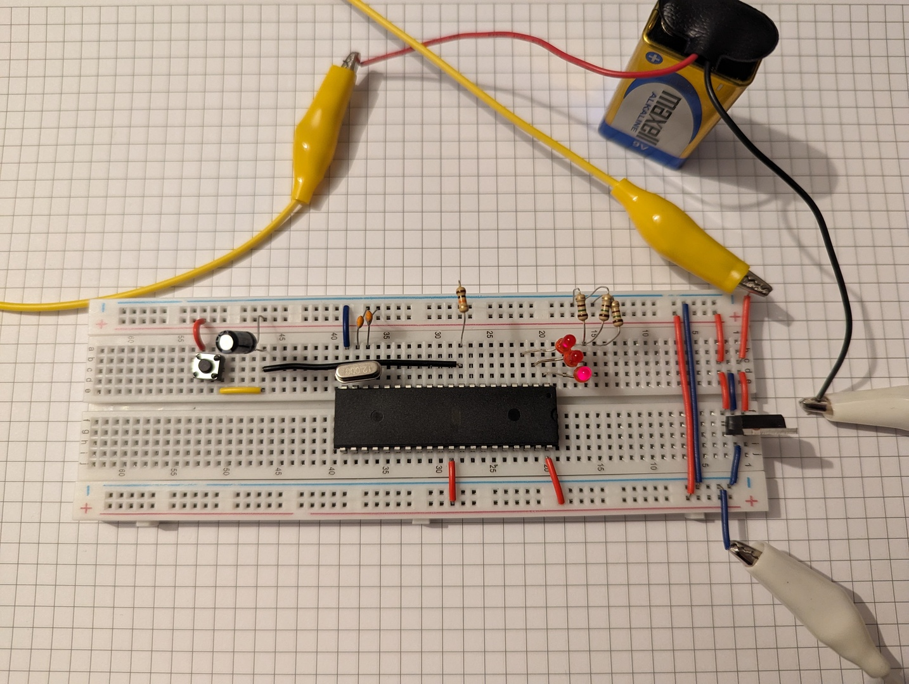

# About

Blinking LEDs using Atmel AT89S52. Arduino Uno R3 was used as programmer.

<p align="center">

</p>

## Setup

```bash
$ sudo apt install sdcc make
$ make
```

In Arduino IDE (2.3.0):
- File | Examples | 11.ArduinoISP | ArduinoISP
- Tools | Programmer | Arduino as ISP

## Upload flash

```bash
$ avrdude -C avrdude-AT89S52.conf -c stk500v1 -P /dev/ttyACM0 -b 19200 -p AT89S52 -U flash:w:"main.ihx":a
```

## Download flash

```bash
$ avrdude -C avrdude-AT89S52.conf -c stk500v1 -P /dev/ttyACM0 -b 19200 -p AT89S52 -D -U flash:r:"flash.bin":r
```

# References
- [8-bit Microcontroller with 8K Bytes In-System Programmable Flash AT89S52](https://ww1.microchip.com/downloads/en/DeviceDoc/doc1919.pdf)
- Vooi Yap. [Programming the AT89S52 Using Arduino Uno](https://www.youtube.com/watch?v=qzqSjv65ubQ)
